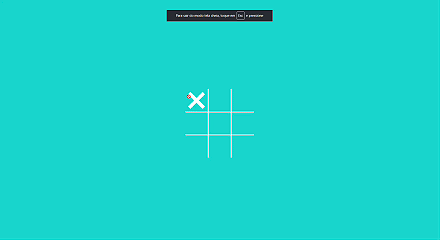

# Jogo da Velha (Tic-Tac-Toe)

Jogo da Velha — implementação clássica do Tic-Tac-Toe em JavaScript/HTML/CSS. Projeto para demonstrar lógica de jogo e manipulação do DOM.

## Principais funcionalidades

- Jogo para 2 jogadores (X e O) no mesmo dispositivo.
- Verificação de vitória e empate.
- Botão de Reiniciar partida.
- Animações visuais simples para jogadas e vitória.

## Tech Stack

- HTML
- CSS
- JavaScript

## Uso / Como jogar

- Dois jogadores revezam-se clicando nas células do tabuleiro.
- O jogador X começa.
- O objetivo é alinhar três símbolos em linha, coluna ou diagonal.
- Ao detectar vitória, o jogo mostra o vencedor; em caso de preenchimento sem vencedor, o jogo declara empate.
- Clique em "Reiniciar" para começar uma nova partida.

## Deploy

- GitHub Pages

clique [aqui](https://leopinheirosilva.github.io/jogo-da-velha/) para acessar o site!

## Contato

Email: <leonardopinheirosilva16@gmail.com>

LinkedIn: <https://www.linkedin.com/in/leonardo-pinheiro-13ba26281/>
